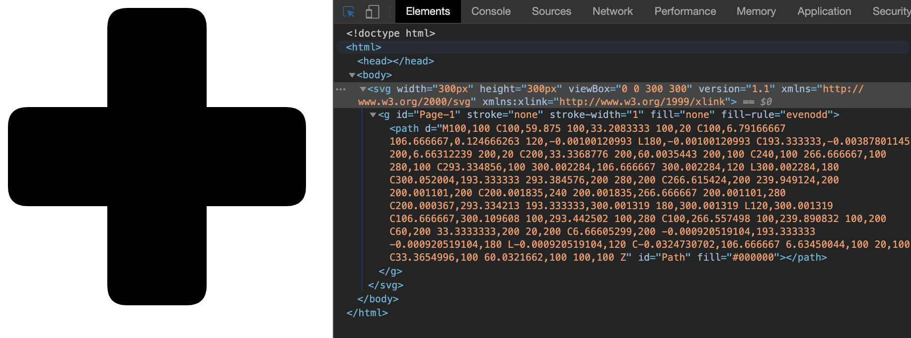
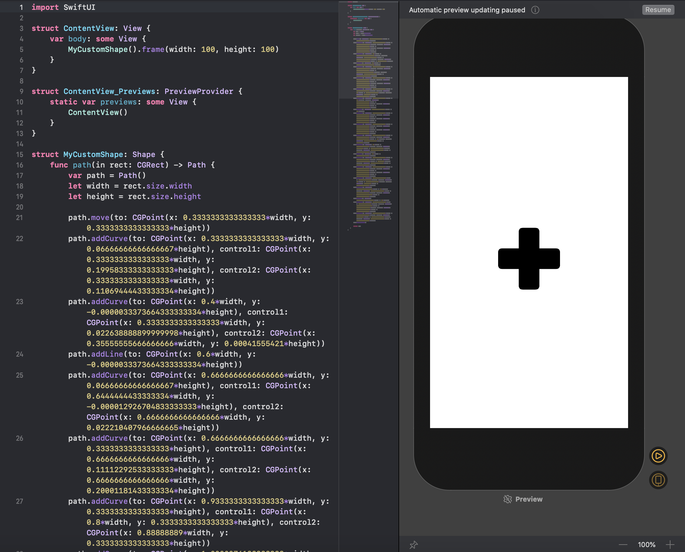

# SVG-to-SwiftUI

Tool to convert SVG to SwiftUI's Shape structure. This approach is much more memory efficient than introducing a SVG library for rendering.

**Disclaimer:** If you need to import SVG into SwiftUI app, it's better to use [this](https://developer.apple.com/documentation/uikit/uiimage/creating_custom_symbol_images_for_your_app) guide to create a symbol instead. This tool might be useful in some particular situations though.

## Usage

Just follow the link in the repository description, it's intuitive from there on.

## Functionality Coverage

This program supports a very limited conversion. In particular it can only use M, L, C and Z data points for now, more functionality comming later.
The code is structured in a way that allows to add new functionality quite easily, so feel free to contribute or submit an issue here on Github.

## Example usage

To demonstrate this tool I created a thicc plus sign with rounded corners (created it in Sketch, so shapes from Sketch should work fine with this tool).
It's saved as 'demo-plus.svg' file in this repository. You can see below how it looks like in the browser, and how it looks like after converting into SwiftUI Shape.

### In the browser

### In SwiftUI View, exported as a Shape

