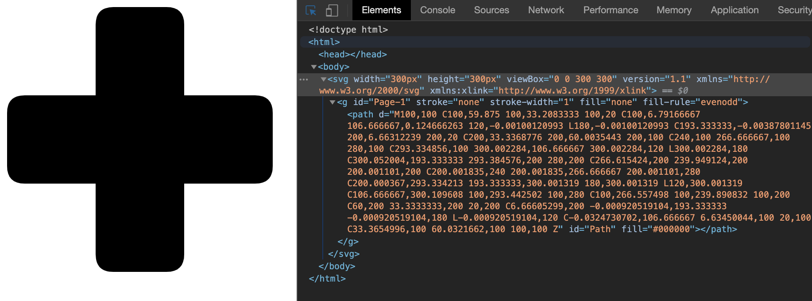
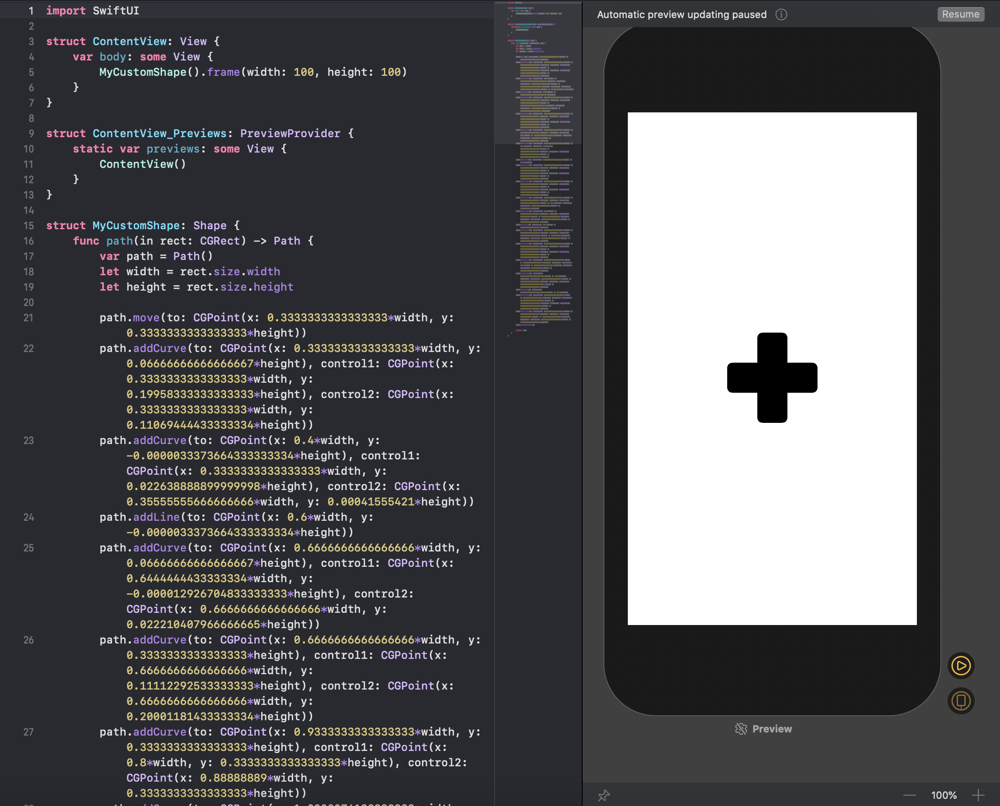

# SVG to SwiftUI Converter

Tool to convert SVG to SwiftUI's Shape structure. This approach is much more memory efficient than introducing a SVG library for rendering.

## Disclaimer (Before you use this tool)

This tool is for use cases, where creating an SF symbol is not viable, e.g. for complex animations. This tool also works great if you're under time pressure or when lazy, and need an icon asap. For general purpose icons it might be better to use [this](https://developer.apple.com/documentation/uikit/uiimage/creating_custom_symbol_images_for_your_app) guide to create an SF Symbol instead.

## Quick Links

- [Web App (SVG to SwiftUI)](https://svg-to-swiftui.quassum.com?utm_source=github&utm_medium=readme)
- [Figma Plugin](https://dub.sh/figma-to-swiftui)

## Usage

### Step 1

⭐️ Star [this](https://github.com/bring-shrubbery/SVG-to-SwiftUI) repository! ⭐️

### Step 2.1: Online

The tool is available online, just follow [this](https://svg-to-swiftui.quassum.com/) link.

### Step 2.2: Running locally

```
git clone https://github.com/bring-shrubbery/SVG-to-SwiftUI
cd SVG-to-SwiftUI
bun install
bun dev
```

## Demo preview

To demonstrate this tool I created a thicc plus sign with rounded corners (created it in Sketch, so shapes from Sketch should work fine with this tool).
It's saved as `content/demo-plus.svg` file in this repository. You can see below how it looks like in the browser, and how it looks like after converting into SwiftUI Shape.

### In the browser



### In SwiftUI View, exported as a Shape



## Contributing

- Feel free to open an issue for the SVG code that did not work - provide the SVG code of course!
- Pull requests are very welcome! Introducing support for more SVG element types would be the best contribution at this point.

## Author

Please consider following this project's author, Antoni on [Github](https://github.com/bring-shrubbery) or [Twitter/X](https://x.com/bringshrubberyy), to show your support.

## License

[MIT](https://github.com/bring-shrubbery/SVG-to-SwiftUI/blob/master/LICENSE)
