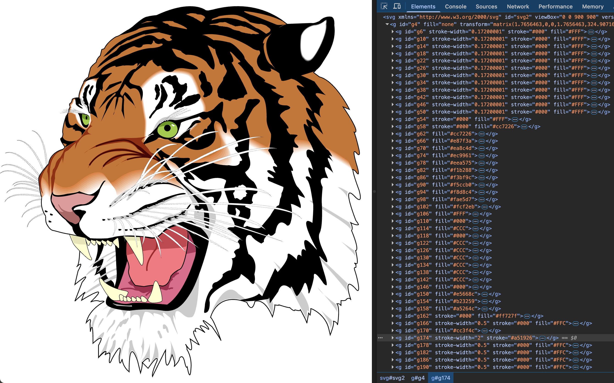
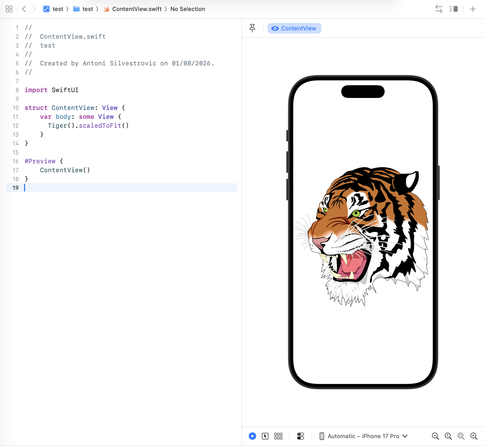

# SVG to SwiftUI

Convert SVG artwork into native, scalable SwiftUI code—while preserving the original appearance.

[](https://github.com/bring-shrubbery/SVG-to-SwiftUI/actions/workflows/main.yml)
[](https://www.npmjs.com/package/svg-to-swiftui-core)
[](LICENSE)

[Try the web app](https://svg-to-swiftui.quassum.com?utm_source=github&utm_medium=readme) · [Install the Figma plugin](https://dub.sh/figma-to-swiftui) · [Static report](packages/svg-to-swiftui-core/conformance/REPORT.md) · [Animation report](packages/svg-to-swiftui-core/conformance/ANIMATION_REPORT.md)

## Production SVGs, not just simple icons

The compiler targets the complete **static appearance of SVG 2 and Filter Effects Level 1**. Simple artwork becomes a compact, tintable SwiftUI `Shape`; richer artwork becomes a layered SwiftUI `View` backed by native paths and `Canvas` rendering.

- **338 supported static entries** across elements, attributes, properties, and filter primitives
- **0 unsupported static blockers** in the versioned 449-entry conformance inventory
- **1,909 deterministic visual tests** that compile and render the generated SwiftUI
- Strict and permissive conversion modes with structured, source-located diagnostics
- Exact-time animation playback with injectable clocks and immutable event traces

Declarative SVG animation is compiled too: SMIL timing and values, `<animate>`, `<set>`, transforms, motion paths, timed discard, deterministic events, and CSS `@keyframes`. The versioned [dynamic profile](packages/svg-to-swiftui-core/conformance/svg-animation-profile.json) contains **234 classified entries and zero unsupported blockers**. Browser scripting, live DOM/network mutation, navigation, and media playback remain intentionally outside the deterministic native runtime.

## SVG in. Native SwiftUI out.

This Ghostscript Tiger contains 240 paths, 241 groups, transforms, strokes, and many colors. The generated Swift compiles and renders as native SwiftUI while retaining the original detail.

| Original SVG | Generated SwiftUI |
| --- | --- |
|  |  |

## What is supported

- Paths and basic shapes, groups, transforms, reusable `defs`/`use`, symbols, nested SVG viewports, and every `preserveAspectRatio` mode
- Embedded CSS, inheritance, custom properties, `currentColor`, selector specificity, visibility, painter order, and opacity
- Solid colors, linear and radial gradients, repeating patterns, clipping paths, masks, blend modes, and isolation
- Advanced strokes, dashes, non-scaling strokes, and start/mid/end markers with context paint
- Static text, `tspan`, text paths, custom fonts, bidirectional and vertical layout, and text decoration
- PNG, JPEG, WebP, GIF, and nested SVG images with deterministic, secure resource resolution
- Filter graphs including blur, shadows, color and component transforms, compositing, morphology, displacement, turbulence, convolution, diffuse lighting, and specular lighting
- Accessibility metadata, conditional rendering, and secure conversion-time `foreignObject` snapshots

Generated views require SwiftUI `Canvas`: iOS 15, macOS 12, tvOS 15, or watchOS 8 and newer. See the [core package documentation](packages/svg-to-swiftui-core/README.md) for detailed behavior and APIs.

## Use it

### Web app

Paste an SVG into [svg-to-swiftui.quassum.com](https://svg-to-swiftui.quassum.com?utm_source=github&utm_medium=readme), then copy the generated SwiftUI into your project.

### JavaScript API

```sh
npm install svg-to-swiftui-core
```

```ts
import { convert } from "svg-to-swiftui-core";

const swift = convert(svgSource, {
  structName: "AppIcon",
  preserveColors: true,
  strict: true,
});
```

Use `convertDetailed()` or `convertDetailedAsync()` when you also need diagnostics, conformance details, resource artifacts, or `foreignObject` snapshots.

## How visual accuracy is verified

Every visual fixture runs through the real compiler pipeline:

```text
SVG source → generate Swift → compile with swiftc → render with SwiftUI → compare full RGBA pixels
```

The original SVG is independently rendered as the reference. The harness compares transparent RGBA output—not screenshots judged by eye—and reports channel, alpha, and differing-pixel metrics. The corpus includes small focused cases, real icon libraries, design-tool exports, and complex artwork such as the Ghostscript Tiger.

Animation coverage uses a 10-step known-good ladder, from one numeric property through a combined scene with motion, transforms, paint servers, compositing, filters, text, and CSS. WebKit and generated SwiftUI render identical microsecond timestamps for frame-by-frame comparison. CI also publishes reference, SwiftUI, side-by-side, and amplified-difference videos for review.

## Run locally

```sh
git clone https://github.com/bring-shrubbery/SVG-to-SwiftUI.git
cd SVG-to-SwiftUI
bun install
bun dev
```

Useful checks:

```sh
bun run build
bun run test
bun run typecheck
bun run conformance:verify
bun run visual-test       # macOS: compiles and compares all SwiftUI renders
bun run animation-test    # macOS: compares exact SVG and SwiftUI frame times
```

## Project structure

- `packages/svg-to-swiftui-core` — the SVG compiler published to npm
- `apps/nextjs` — the online converter
- `packages/figma-to-swiftui` — the Figma plugin

## When to use this

This project is especially useful for detailed illustrations, one-off assets, generated graphics, and artwork that needs to remain editable or animatable in SwiftUI. For general-purpose monochrome icons, consider creating a custom [SF Symbol](https://developer.apple.com/documentation/uikit/uiimage/creating_custom_symbol_images_for_your_app).

## Contributing

Issues and pull requests are welcome. If an SVG does not render correctly, please attach the original SVG and describe the expected result so it can become a permanent visual regression test.

## Author

Created by [Antoni Silvestrovic](https://antoni.ai). You can also follow Antoni on [GitHub](https://github.com/bring-shrubbery) or [X](https://x.com/bringshrubberyy).

## License

The project is available under the [MIT License](LICENSE). Separately sourced fixtures are documented in [static visual attribution](packages/svg-to-swiftui-core/visual-tests/ATTRIBUTION.md) and [animation attribution](packages/svg-to-swiftui-core/animation-tests/ATTRIBUTION.md).
